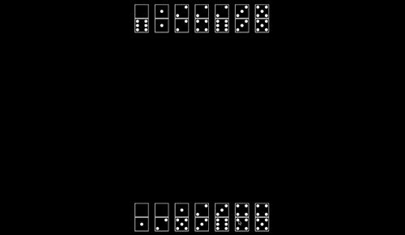
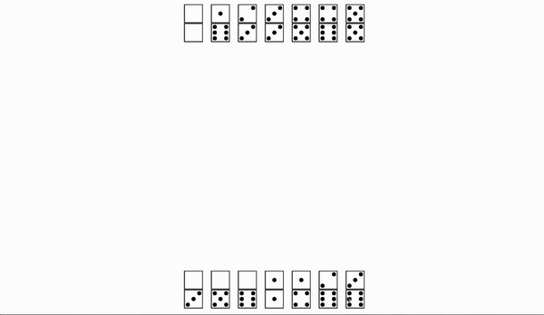

## Adding a game

We describe here only the simplest and fastest way to add a new game. It is
ideal to first be aware of the general API for OpenSpiel (see `open_spiel/spiel.h`).

1.  Choose a game to implement from in `open_spiel/games/` or
    `open_spiel/python/games/` (or implement your own within the API's framework)! Then, copy a game
    from `pygame_spiel/games/`. Suggested games: Tic-Tac-Toe and Breakthrough for perfect information without chance
    events, and block dominoes for imperfect information games. For the rest of these steps, we ssume Tic-Tac-Toe.
2.  Copy the game script and source image directory: `pygame_spiel/games/tic_tac_toe.py`, and
    `pygame/images/tic_tac_toe/` to `pygame_spiel/games/new_game.py` and `pygame/images/new_game/`.
3.  Update boilerplate code:
    *   Add the appropriate game string to `pygame_spiel/games/settings.py`, ensuring it matches the OpenSpiel API. Here is your chance to also specify the bots you'll support (see adding a bot for more).
    *   In the new files, rename the inner-most namespace from `tic_tac_toe` to
        `new_game`.
    *   In the new file, rename `TicTacToeGame` to
        `NewGameGame`.
    * In `__init__py`, import your NewGame class `from pygame_spiel.games.new_game import NewGame`.
    *   At the top of `new_game.cc`, change the short name to `new_game` and
        include the new game’s header.
4.  You should now have a duplicate game of Tic-Tac-Toe under a different name.Now, change the implementations of the functions in `NewGameGame` and
    `NewGameState` to reflect your new game’s logic. Most API functions should be clear from the game you copied from.
5. Add your game to the dropselect menu in `pygame_spiel/menu.py`.
6.  To test the game as it is being built, you can install the library    in development mode play test the functionality interactively using the `pygame_spiel` command  in the console.
7.  Run your code through a linter so it conforms to Google's
    [style guides](https://google.github.io/styleguide/). For C++ use
    [cpplint](https://pypi.org/project/cpplint/). For Python, use
    [pylint](https://pypi.org/project/pylint/) with the
    [pylintrc from the Google style guide](https://google.github.io/styleguide/pyguide.html).
    There is also [YAPF](https://github.com/google/yapf/) for Python as well.

## Adding a bot

Bots follow the standard RL structure, specified for OpenSpiel in 
`open_spiel/python/rl_agent.py`. The key element is the `step` function.

1. Specify the name of the bot(s) available for your game at the top of `pygame_spiel/games/settings.py`.
2. If your bot type hasn't yet been implemented, you'll need to add it to the `init_bot(...)` function in `pygame_spiel/utils.py`.

